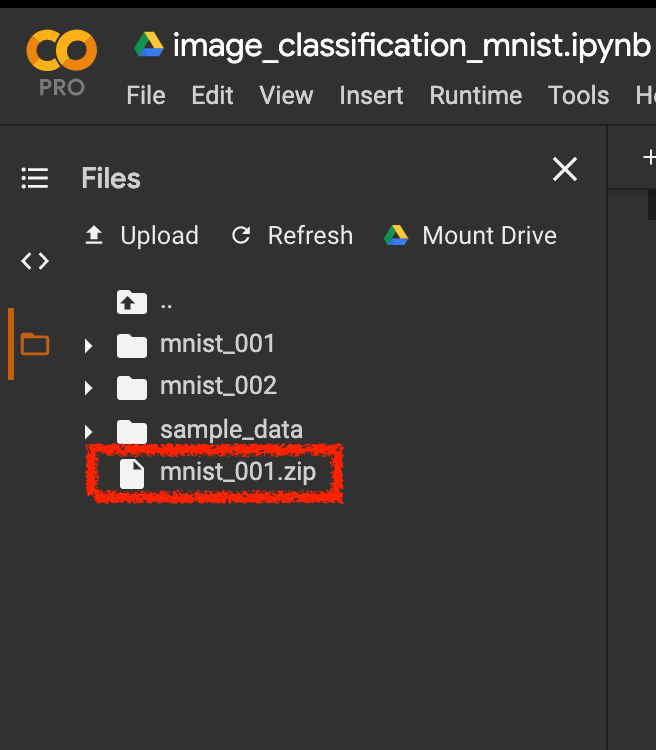

# MNIST 서버 예제

## 환경 세팅

1. Adaconda 설치
2. 아나콘다로 가상환경 접속
3. 필요 python 라이브러리 설치

### 1. Anaconda 설치

- macOS - [Installing on macOS](https://docs.anaconda.com/anaconda/install/mac-os/)
- Ubuntu 18.04 - [How To Install Anaconda on Ubuntu 18.04 [Quickstart]](https://www.digitalocean.com/community/tutorials/how-to-install-anaconda-on-ubuntu-18-04-quickstart)

### 2. 아나콘다로 가상환경 생성 및 접속

서버 앱을 위한 아나콘다 가상환경

```shell
# 가상환경 생성
$ conda create -n {가상환경_이름} python=3.6
# conda create -n tf2_mnist_server_env python=3.6

# 가상환경 접속
$ conda activate {가상환경_이름}
# or
$ source activate {가상환경_이름}
# conda activate tf2_mnist_server_env
```

### 3. 필요 python 라이브러리 설치

```shell
(tf2_mnist_server_env) $ cd ~/MNIST-ml-to-mobile/app-server
(tf2_mnist_server_env) $ pip install -r requirements.txt
```

## 모델 준비

아래 두가지 방법 중 한가지 방법으로 `MNIST-ml-to-mobile/outputs/saved_model` 폴더 안에 saved_model을 준비합니다. 

### 방법1. 로컬에서 training 예제로 모델 구하기

[`training`](../training) 예제를 정상적으로 끝내면 `MNIST-ml-to-mobile/outputs/saved_model` 경로 안에 **학습된 모델**이 저장됩니다. (단, 로컬(맥북)에서 학습을 수행하면 시간이 다소 걸리고 컴퓨터가 뜨거워질 수 있습니다)

### 방법2. Colab에서 학습 후 모델 다운받기

1. Colab 코드 하단에 아래 셀을 추가합니다.

```python
# 모델을 저장
model.save('mnist_001')
# 저장된 모델을 압축
!zip -r mnist_001.zip mnist_001
```

2. 압축된 `mnist_001.zip`을 더블클릭하여 로컬에 다운로드 받습니다.



3. `mnist_001.zip`를 `outputs/saved_model`에 옮겨 압축을 풉니다.

## 실행 방법

### 1. conda로 가상환경 접속

```shell
$ conda activate {가상환경_이름}
# conda activate tf2_mnist_server_env
```

### 2. 앱 실행

```shell
(tf2_mnist_server_env_01) $ python app.py
 * Serving Flask app "app" (lazy loading)
 * Environment: production
   WARNING: This is a development server. Do not use it in a production deployment.
   Use a production WSGI server instead.
 * Debug mode: on
 * Running on http://127.0.0.1:5000/ (Press CTRL+C to quit)
 * Restarting with stat
```

## MNIST API

## 브라우저용

```
GET /mnist
```

## 추론용

```
POST /mnist
```

### Header

```
Content-Type: 'multipart/form-data'
```

### Input

| 이름        | 타입 | 설명                 | 비고                      |
| ----------- | :--: | -------------------- | ------------------------- |
| mnist_image | File | 0~9 사이 손글씨 사진 | `png`, `jpg`, `jpeg` 지원 |

### Response

```
Status: 200 OK
```

```json
{
  "filename": "qg0H2.png",
  "pred_number": 8,
  "pred_label": [
    [0, 0, 0, 0, 0, 0, 0, 0, 1, 0]
  ]
}
```


## 참고

- https://medium.com/@BhashkarKunal/image-classification-api-creation-using-tensorflow-flask-mongodb-61a53835e62d
- https://flask.palletsprojects.com/en/1.1.x/patterns/fileuploads/
- https://oss.navercorp.com/tapas/tapas/blob/develop/packages/server/src/controllers/ocr/README.md
- https://oss.navercorp.com/PDP/receipt-prediction